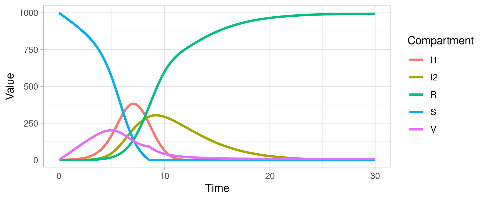

# discreteModel
An R package for simulating discrete-time non-Markovian compartmental model.

## Installation
Use `install_github()` to install this package
```
remotes::install_github("thinhong/discreteModel")
```

## Example
### Simple SIR model

```
library(discreteModel)

initialValues <- c(
  S = 999, 
  I = 1, 
  R = 0, 
  V = 0, 
  IV = 0
)

parameters <- c(
  beta = 0.12,
  N = 1000
)

transitions <- list(
  "0.3 * S -> I" = mathExpression(beta * S * (I + IV) / N),
  "0.7 * S -> V" = constant(2),
  "I -> R" = gamma(3, 2),
  "V -> IV" = mathExpression(beta * 0.3 * V * (I + IV) / N),
  "IV -> R" = exponential(2)
)

simulationDuration <- 10
timeStep <- 0.01

mod <- runSim(transitions = transitions, initialValues = initialValues, parameters = parameters, 
              simulationDuration = simulationDuration, timeStep = timeStep)
```

Here we have to define:
* `daysFollowUp`: how many days (or any unit of time) to simulate
* `errorTolerance`: a decimal number, when a probability reach (1 - `errorTolerance`) it will be rounded to 1.0, e.g if we set `errorTolerance <- 0.01` then when a probability is 0.99 it will be rounded to 1.0
* `timeStep`: how much a day will be binned, if we want to bin a day into 100 time bins, a time step will be 0.01 day, define here `timeStep <- 0.01`
* `initialValues`: a vector defines initial values of compartments
* `parameters`: if we define a compartment transition using math expression, list all parameters (except the compartment names) inside the math expression here
* `transitions`: a list with format `"transition" = distribution()`
  * `"transition"`: structure of the model, e.g a simple SIR model S -> I -> R would be defined by `"S -> I"`, `"I -> R"` (note the `""` symbol, this will be read as strings), white space can be ignored here i.e we can write `"S->I"`
    * `"S -> I"`, `"S -> V"`: compartment S transitions to I first, then the rest of S transitions to V
    * `"S -> 0.3 * I"`, `"S -> 0.7 * V"`: S transitions to I and V concurrently, of which 30% transitions to I and 70% transitions to V
* `distributions`: distributions of compartments, currently the followings are available:
  * `exponential(rate)`
  * `gamma(scale, shape)`
  * `weibull(scale, shape)`
  * `mathExpression(expression)`: user-defined math expression, the expression can be put inside `""` or not, e.g `mathExpression(beta * S * I / N)` or `mathExpression("beta * S * I / N")` are both acceptable
  * `frequency(frequency)`: a fixed number of individuals per time step, e.g `"S -> V" = frequency(50)` means 50 people got vaccinated per day
  * `transitionProb(transitionProb)`: define a transition probability instead of waiting time distribution, this is the conventional dR/dt = gamma * I which we input by `"I -> R" = transitionProb(gamma)`
  * `values(waitingTimes...)`: a vector of values, could be numbers, percentages, density based on real data distribution


### Visualization
We can plot the data frame generated by `runSim()` function with `plot()`. The `plot()` function use ggplot2 to visualize.
```
plot(mod)
```


### Comparison with deSolve
Binning timeStep into 0.001 to have the closest results to deSolve. 
```
library(deSolve)
library(discreteModel)
library(ggplot2)
library(tidyr)

# deSolve
sir_equations <- function(time, variables, parameters) {
  with(as.list(c(variables, parameters)), {
    dS <- -beta * (I1 + I2 + I3 + I4 + I5) * S
    dI1 <- (beta * (I1 + I2 + I3 + I4 + I5) * S) - (gamma * I1)
    dI2 <- (gamma * I1) - (gamma * I2)
    dI3 <- (gamma * I2) - (gamma * I3)
    dI4 <- (gamma * I3) - (gamma * I4)
    dI5 <- (gamma * I4) - (gamma * I5)
    dR <-  gamma * I5
    return(list(c(dS, dI1, dI2, dI3, dI4, dI5, dR)))
  })
}

parameters_values <- c(beta  = 0.0015, gamma = 0.5)
initial_values <- c(S = 999, I1 = 1, I2 = 0, I3 = 0, I4 = 0, I5 = 0, R = 0)
time_values <- seq(0, 20)

dsmod <- ode(
  y = initial_values,
  times = time_values,
  func = sir_equations,
  parms = parameters_values
)

## Sum up I1 + I2 + I3 + I4 + I5 to get the final I compartment
dsmod <- as.data.frame(dsmod)
dsmod$I <- rowSums(dsmod[,grep("I", colnames(dsmod))])
dsmod <- dsmod[, c("time", "S", "I", "R")]
colnames(dsmod)[-1] <- paste0(colnames(dsmod)[-1], "_deSolve")

# Our method
initialValues <- c(S = 999, I = 1, R = 0)
parameters <- c(beta = 0.0015, N = 1000)
transitions <- list("S -> I" = mathExpression(beta * S * I / N), 
                    "I -> R" = gamma(2, 5))

fmod <- runSim(daysFollowUp = 20, errorTolerance = 0.01, 
               timeStep = 0.001,
               transitions = transitions,
               initialValues = initialValues, parameters = parameters)

# Merge the two results data frame to compare
colnames(fmod)[-1] <- paste0(colnames(fmod)[-1], "_discrete")
df2 <- merge(dsmod, fmod, by.x = "time", by.y = "Time")

# We can make comparison by viewing the merged data frame
df2

# Or plot them using these ggplot2 codes
df_plot <- gather(df2, key = "Compartment", value = "Value", grep("time", colnames(df2), invert = T))
df_plot$package <- sapply(df_plot$Compartment, function(x) {a <- strsplit(x, "_")[[1]]; b <- a[length(a)]; return(b)})
df_plot$Compartment <- gsub("_deSolve|_discrete", "", df_plot$Compartment)
df_plot$Compartment <- factor(df_plot$Compartment)

ggplot(df_plot, aes(x = time, y = Value, col = Compartment)) +
  geom_line(size = 1) + facet_wrap(~ package) +
  theme_minimal() +
  theme(text = element_text(size = 14))
```
The results are as follows
```
   time    S_deSolve  I_deSolve    R_deSolve   S_discrete I_discrete   R_discrete
1     0 9.990000e+02   1.000000 0.000000e+00 9.990000e+02   1.000000 0.000000e+00
2     1 9.955339e+02   4.465856 2.303639e-04 9.955389e+02   4.460865 2.301190e-04
3     2 9.802964e+02  19.696340 7.267827e-03 9.803393e+02  19.653437 7.257803e-03
4     3 9.174280e+02  82.509558 6.244174e-02 9.176736e+02  82.264069 6.232200e-02
5     4 7.128656e+02 286.788494 3.458764e-01 7.136823e+02 285.972686 3.449851e-01
6     5 3.570668e+02 641.372446 1.560792e+00 3.580034e+02 640.440678 1.555952e+00
7     6 1.108652e+02 883.247525 5.887297e+00 1.112038e+02 882.927489 5.868694e+00
8     7 2.753151e+01 954.609024 1.785947e+01 2.759597e+01 954.594431 1.780960e+01
9     8 6.560794e+00 950.121748 4.331746e+01 6.568916e+00 950.212553 4.321853e+01
10    9 1.618453e+00 911.744233 8.663731e+01 1.618522e+00 911.901014 8.648046e+01
11   10 4.304366e-01 850.902950 1.486666e+02 4.299393e-01 851.114669 1.484554e+02
12   11 1.270917e-01 773.290746 2.265822e+02 1.267988e-01 773.543162 2.263300e+02
13   12 4.253584e-02 684.835925 3.151215e+02 4.239289e-02 685.110767 3.148468e+02
14   13 1.632456e-02 591.799588 4.081841e+02 1.625438e-02 592.078497 4.079052e+02
15   14 7.202036e-03 499.863552 5.001292e+02 7.165272e-03 500.131156 4.998617e+02
16   15 3.633768e-03 413.460732 5.865356e+02 3.612778e-03 413.706068 5.862903e+02
17   16 2.074540e-03 335.535057 6.644629e+02 2.061332e-03 335.751685 6.642463e+02
18   17 1.321349e-03 267.628893 7.323698e+02 1.312357e-03 267.814259 7.321844e+02
19   18 9.245871e-04 210.148809 7.898503e+02 9.179818e-04 210.303240 7.896958e+02
20   19 6.998868e-04 162.688892 8.373104e+02 6.946921e-04 162.814630 8.371847e+02
21   20 5.649312e-04 124.335796 8.756636e+02 5.606225e-04 124.436154 8.755633e+02
```

