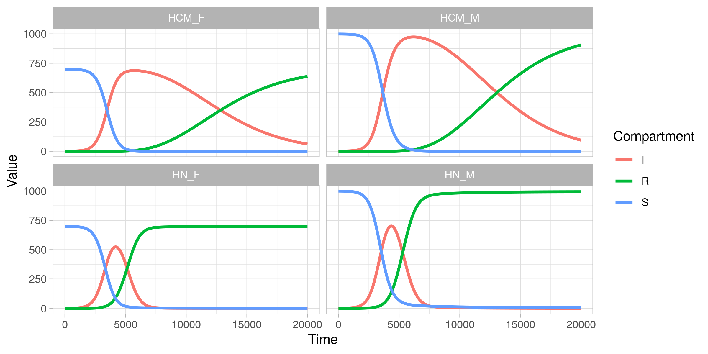
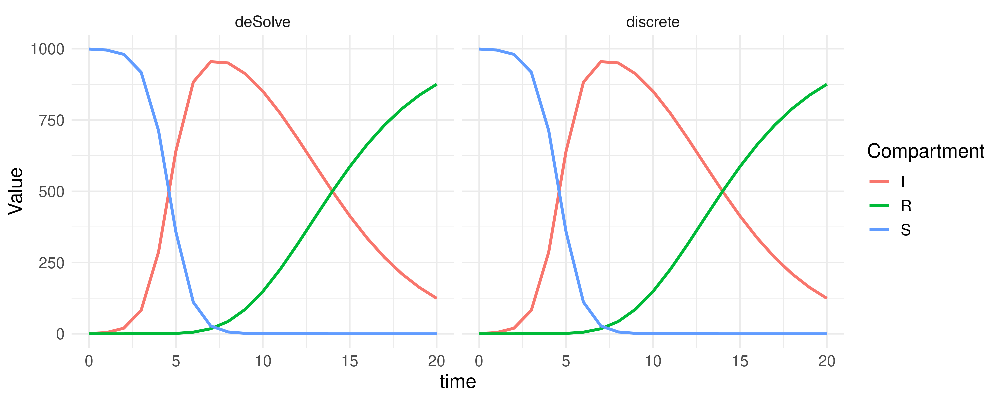

# discreteModel
An R package for simulating discrete-time non-Markovian compartmental model.

Table of Contents
=================

   * [Installation](#installation)
   * [Example](#example)
      * [Simple SIR model without contact](#simple-sir-model-without-contact)
      * [Contact between locations](#contact-between-locations)
      * [Visualization](#visualization)
      * [Helper function](#helper-function)
      * [Comparison with deSolve](#comparison-with-desolve)


## Installation
Use `install_github()` to install this package
```
remotes::install_github("thinhong/discreteModel")
```

## Example
### Simple SIR model without contact
Here we have to define:
* `transitions`: structure of the model or transitions among compartments, for instance S -> I -> R would be defined by `"S -> I"`, `"I -> R"` (note the `""` symbol, this will be read as strings), white space can be ignored here (i.e we can write `"S->I"`)
* `initialValues`: a vector defines initial values of compartments
* `distributions`: distributions of compartments, currently `exponential(rate)`, `gamma(scale, shape)`, and `weibull(scale, shape)` are available
```
library(discreteModel)

transitions <- c(
  "S -> E",
  "E -> I",
  "I -> R"
)

initialValues <- c(
  S = 999,
  E = 0,
  I = 1,
  R = 0
)

distributions <- c(E = weibull(scale = 2, shape = 5), 
                   I = exponential(rate = 1.5))

fmod <- runSim(daysFollowUp = 5000, errorTolerance = 0.01, timeStep = 0.001, 
               transmissionRate = 1.5, infectiousComps = "I", 
               transitions = transitions,
               initialValues = initialValues, distributions = distributions)
```

### Contact between locations
We now add another parameter `contacts`: a list of contact matrices. If we have contact between locations, `initialValues` and `distributions` will be lists of locations. The name of elements of `initialValues` and `distributions` need to match the dimension names of the matrices.

This script will simulate a SIR model of 2 locations: Ho Chi Minh and Ha Noi.
```
M_location <- matrix(c(0.85, 0.1, 0.1, 0.95), nrow = 2, ncol = 2, 
                     dimnames = list(c("HCM", "HN"), c("HCM", "HN")))

transitions <- c(
  "S -> I", 
  "I -> R"
)

initialValues <- list(
  HCM = c(
    S = 999,
    I = 1,
    R = 0),
  HN = c(
    S = 699,
    I = 0,
    R = 0)
)

distributions <- list(
  HCM = c(I = gamma(scale = 2, shape = 5)),
  HN = c(I = weibull(scale = 2, shape = 5))
)

fmod <- runSim(daysFollowUp = 5000, errorTolerance = 0.01, timeStep = 0.001, 
               transmissionRate = 1.5, infectiousComps = "I", 
               contacts = M_location, transitions = transitions,
               initialValues = initialValues, distributions = distributions)
```

If we only have one type of contact, we can directly parse the contact matrix into parameter `contacts` of `runSim()`
```
M_location <- matrix(c(0.85, 0.1, 0.1, 0.95), nrow = 2, ncol = 2, 
                     dimnames = list(c("HCM", "HN"), c("HCM", "HN")))

fmod <- runSim(daysFollowUp = 5000, errorTolerance = 0.01, timeStep = 0.001, 
               transmissionRate = 1.5, infectiousComps = "I", 
               contacts = M_location, transitions = transitions,
               initialValues = initialValues, distributions = distributions)
```

If we have more than one type of contact:
* `contacts` must be defined as a list of contact matrices
```
M_location <- matrix(c(0.85, 0.1, 0.1, 0.95), nrow = 2, ncol = 2, 
                     dimnames = list(c("HCM", "HN"), c("HCM", "HN")))
M_gender <- matrix(c(0.5, 0.75, 0.75, 0.95), nrow = 2, ncol = 2, 
                     dimnames = list(c("M", "F"), c("M", "F")))

contacts <- list(M_location, M_gender)
```
* Use `.` to define the names of elements inside `initialValues` and `distributions`

Full input should be defined as follows
```
M_location <- matrix(c(0.85, 0.1, 0.1, 0.95), nrow = 2, ncol = 2, 
                     dimnames = list(c("HCM", "HN"), c("HCM", "HN")))
M_gender <- matrix(c(0.5, 0.75, 0.75, 0.95), nrow = 2, ncol = 2, 
                     dimnames = list(c("M", "F"), c("M", "F")))

contacts <- list(M_location, M_gender)

transitions <- c(
  "S -> I", 
  "I -> R"
)

initialValues <- list(
  HCM.M = c(
    S = 999,
    I = 1,
    R = 0),
  HCM.F = c(
    S = 699,
    I = 0,
    R = 0),
  HN.M = c(
    S = 999,
    I = 1,
    R = 0),
  HN.F = c(
    S = 699,
    I = 0,
    R = 0)
)

distributions <- list(
  HCM.M = c(I = gamma(scale = 2, shape = 5)),
  HCM.F = c(I = gamma(scale = 2, shape = 5)),
  HN.M = c(I = weibull(scale = 2, shape = 5)),
  HN.F = c(I = weibull(scale = 2, shape = 5))
)

fmod <- runSim(daysFollowUp = 20000, errorTolerance = 0.01, timeStep = 0.001, 
               transmissionRate = 1.5, infectiousComps = "I", 
               contacts = contacts, transitions = transitions,
               initialValues = initialValues, distributions = distributions)
```

### Visualization
We can plot the data frame generated by `runSim()` function with `plot()`. The `plot()` function use ggplot2 to visualize. If we have groups that contact with others, it automatically plots multi-panel using `facet_wrap()`.
```
plot(fmod)
```


### Helper function
When there are many compartments, or many contacts, use this `inputHelper()` to assist the definition of initialValues and distributions
```
M_location <- matrix(c(0.85, 0.1, 0.1, 0.95), nrow = 2, ncol = 2, 
                     dimnames = list(c("HCM", "HN"), c("HCM", "HN")))
M_age <- matrix(c(0.5, 0.6, 0.7, 0.6, 0.4, 0.3, 0.7, 0.3, 0.8), nrow = 3, ncol = 3, 
                     dimnames = list(c("young", "middle", "older"), c("young", "middle", "older")))

contacts <- list(M_location, M_age)

transitions <- c(
  "S -> E", 
  "E -> A",
  "A -> I",
  "I -> D",
  "I -> R"
)

inputHelper(contacts = contacts, transitions = transitions)
```

Results
```
# Place these codes under the transitions and contacts you have written
# Set up the initial values for all compartments
initialValues <- list(
  HCM.middle = c(S = , E = , A = , I = , D = , R = ),
  HCM.older = c(S = , E = , A = , I = , D = , R = ),
  HCM.young = c(S = , E = , A = , I = , D = , R = ),
  HN.middle = c(S = , E = , A = , I = , D = , R = ),
  HN.older = c(S = , E = , A = , I = , D = , R = ),
  HN.young = c(S = , E = , A = , I = , D = , R = )
)

# Set up the distributions for all compartments, any compartment without distribution can be deleted
distributions <- list(
  HCM.middle = c(S = , E = , A = , I = , D = , R = ),
  HCM.older = c(S = , E = , A = , I = , D = , R = ),
  HCM.young = c(S = , E = , A = , I = , D = , R = ),
  HN.middle = c(S = , E = , A = , I = , D = , R = ),
  HN.older = c(S = , E = , A = , I = , D = , R = ),
  HN.young = c(S = , E = , A = , I = , D = , R = )
)

# Insert all parameters here, please use ?runSim for more details
fmod <- runSim(daysFollowUp = , errorTolerance = , timeStep = , 
               transmissionRate = , infectiousComps = , 
               contacts = , transitions = ,
               initialValues = initialValues, distributions = distributions)
```

### Comparison with deSolve
```
library(deSolve)
library(discreteModel)
library(ggplot2)
library(tidyr)

days <- 20
timeStep <- 0.001
timeStart <- 1 / timeStep + 2
timeEnd <- days / timeStep + 2

# DeSolve
sir_equations <- function(time, variables, parameters) {
  with(as.list(c(variables, parameters)), {
    dS <- -beta * (I1 + I2 + I3 + I4 + I5) * S
    dI1 <- (beta * (I1 + I2 + I3 + I4 + I5) * S) - (gamma * I1)
    dI2 <- (gamma * I1) - (gamma * I2)
    dI3 <- (gamma * I2) - (gamma * I3)
    dI4 <- (gamma * I3) - (gamma * I4)
    dI5 <- (gamma * I4) - (gamma * I5)
    dR <-  gamma * I5
    return(list(c(dS, dI1, dI2, dI3, dI4, dI5, dR)))
  })
}

parameters_values <- c(beta  = 0.0015, gamma = 0.5)
initial_values <- c(S = 999, I1 = 1, I2 = 0, I3 = 0, I4 = 0, I5 = 0, R = 0)
time_values <- seq(0, days)

dsmod <- ode(
  y = initial_values,
  times = time_values,
  func = sir_equations,
  parms = parameters_values
)

## Sum up I1 + I2 + I3 + I4 + I5 to get the final I compartment
dsmod <- as.data.frame(dsmod)
dsmod$I <- rowSums(dsmod[,grep("I", colnames(dsmod))])
dsmod <- dsmod[, c("time", "S", "I", "R")]
colnames(dsmod)[-1] <- paste0(colnames(dsmod)[-1], "_deSolve")

# Our method
transitions <- c("S -> I", "I -> R")
initialValues <- c(S = 999, I = 1, R = 0)
distributions <- c(I = gamma(2, 5))
fmod <- runSim(daysFollowUp = 21000, errorTolerance = 0.01, 
               timeStep = timeStep, 
               transmissionRate = 1.5, infectiousComps = "I", 
               transitions = transitions,
               initialValues = initialValues, distributions = distributions)

# To compare, first get the time steps we want
times <- seq(timeStart, timeEnd, 1 / timeStep)
fmod <- fmod[c(1, times),]
colnames(fmod)[-1] <- paste0(colnames(fmod)[-1], "_discrete")
fmod$Time[-1] <- (fmod$Time[-1] - 1) * timeStep

df2 <- merge(dsmod, fmod, by.x = "time", by.y = "Time")

# We can make comparison by viewing the merged data frame
df2

# Or plot them using these ggplot2 codes
df_plot <- gather(df2, key = "Compartment", value = "Value", grep("time", colnames(df2), invert = T))
df_plot$package <- sapply(df_plot$Compartment, function(x) {a <- strsplit(x, "_")[[1]]; b <- a[length(a)]; return(b)})
df_plot$Compartment <- gsub("_deSolve|_discrete", "", df_plot$Compartment)
df_plot$Compartment <- factor(df_plot$Compartment)

ggplot(df_plot, aes(x = time, y = Value, col = Compartment)) +
  geom_line(size = 1) + facet_wrap(~ package) +
  theme_minimal() +
  theme(text = element_text(size = 14))
```
The results are as follows
```
   time    S_deSolve  I_deSolve    R_deSolve   S_discrete I_discrete   R_discrete
1     0 9.990000e+02   1.000000 0.000000e+00 9.990000e+02   1.000000 0.000000e+00
2     1 9.955339e+02   4.465856 2.303639e-04 9.955322e+02   4.467525 2.312548e-04
3     2 9.802964e+02  19.696340 7.267827e-03 9.803104e+02  19.682319 7.276330e-03
4     3 9.174280e+02  82.509558 6.244174e-02 9.175604e+02  82.377190 6.243833e-02
5     4 7.128656e+02 286.788494 3.458764e-01 7.133762e+02 286.278277 3.455348e-01
6     5 3.570668e+02 641.372446 1.560792e+00 3.576594e+02 640.782383 1.558167e+00
7     6 1.108652e+02 883.247525 5.887297e+00 1.110565e+02 883.067578 5.875882e+00
8     7 2.753151e+01 954.609024 1.785947e+01 2.755645e+01 954.616214 1.782733e+01
9     8 6.560794e+00 950.121748 4.331746e+01 6.559554e+00 950.188046 4.325240e+01
10    9 1.618453e+00 911.744233 8.663731e+01 1.616308e+00 911.850412 8.653328e+01
11   10 4.304366e-01 850.902950 1.486666e+02 4.293904e-01 851.044558 1.485261e+02
12   11 1.270917e-01 773.290746 2.265822e+02 1.266517e-01 773.459110 2.264142e+02
13   12 4.253584e-02 684.835925 3.151215e+02 4.234933e-02 685.019007 3.149386e+02
14   13 1.632456e-02 591.799588 4.081841e+02 1.623994e-02 591.985149 4.079986e+02
15   14 7.202036e-03 499.863552 5.001292e+02 7.159897e-03 500.041355 4.999515e+02
```
