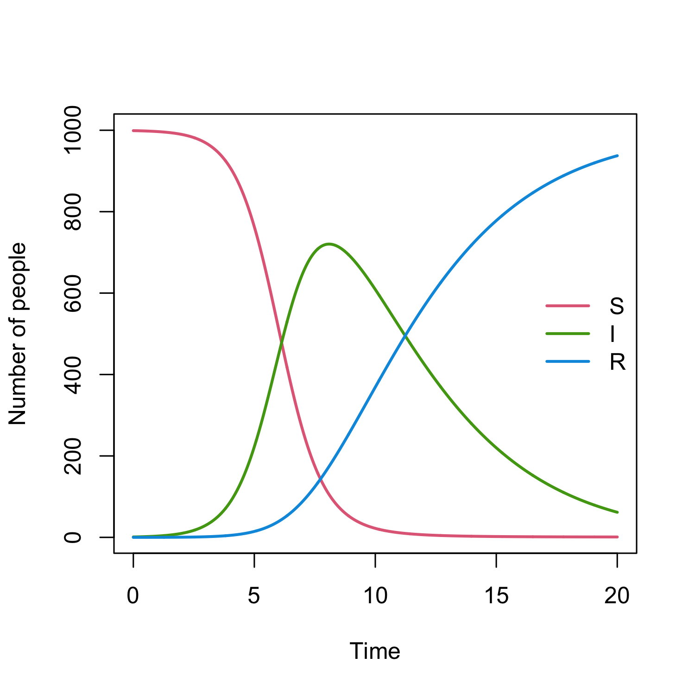

<!-- README.md is generated from README.Rmd. Please edit that file -->

# denim 

<!-- badges: start -->

[](https://www.repostatus.org/#active)
[](https://github.com/thinhong/denim/actions)
<!-- badges: end -->

An R package for building and simulating deterministic discrete-time
compartmental models with memory.

## Installation

You can install the development version of denim from
[GitHub](https://github.com/) with:

``` r
# install.packages("devtools")
devtools::install_github("thinhong/denim")
```

## Example

This is a basic example to illustrate the specification of a simple SIR
model, which contains the three compartments susceptible (S), infected
(I) and recovered (R). The recovery probabilities of infected
individuals are gamma distributed in this example:

``` r
library(denim)

transitions <- list(
  "S -> I" = "beta * S * I / N",
  "I -> R" = d_gamma(3, 2)
)

parameters <- c(
  beta = 0.12,
  N = 1000
)

initialValues <- c(
  S = 999, 
  I = 1, 
  R = 0
)

simulationDuration <- 10
timeStep <- 0.01

mod <- sim(transitions = transitions, initialValues = initialValues, 
           parameters = parameters, simulationDuration = simulationDuration, 
           timeStep = timeStep)
```

The output is a data frame with 4 columns: `Time`, `S`, `I` and `R`

``` r
head(mod)
#>   Time        S        I            R
#> 1 0.00 999.0000 1.000000 0.000000e+00
#> 2 0.01 998.8801 1.119874 5.543225e-06
#> 3 0.02 998.7459 1.254092 2.278823e-05
#> 4 0.03 998.5956 1.404364 5.306419e-05
#> 5 0.04 998.4273 1.572606 9.785981e-05
#> 6 0.05 998.2389 1.760961 1.588423e-04
```

We can plot the output with:

``` r
plot(mod)
```


