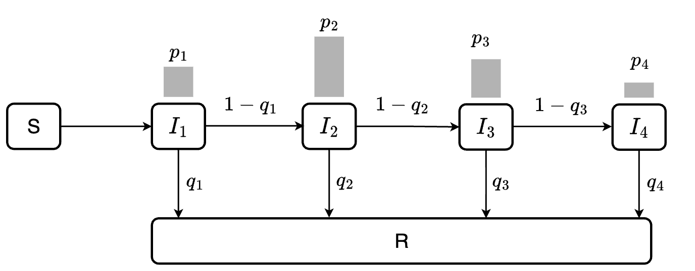
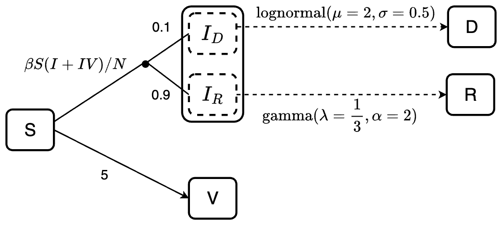

```{r setup, include = FALSE}
knitr::opts_chunk$set(
  collapse = TRUE,
  comment = "#>",
  fig.align="center"
)
library(DiagrammeR) # for flowchart diagram
library(denim)
```

## 1. Simple SIR model with gamma distributed lengths of stay

The SIR model uses 3 compartments: S (susceptible), I (infected), R (recovered) to describe clinical status of individuals. We use the simplest form of SIR model to demonstrate how to define the distribution of the lengths of stay distribution.

<center>{width="400"}</center>

The model equations are:

$$\frac{dS(t)}{dt} = -\lambda S(t) = -\frac{\beta I(t)}{N}S(t)$$ $$\frac{dI(t)}{dt} = \frac{\beta I(t)}{N}S - \gamma I(t)$$ $$\frac{dR(t)}{dt} = \gamma I(t)$$

-   $N$: total population size, $N = S + I + R$
-   $\beta$: the product of contact rates and transmission probability; usually we define $\lambda =\frac{\beta I(t)}{N}$ as the force of infection
-   $\gamma$: recovery rate

For mathematical simplicity, modelers typically assume that the recovery rate $\gamma$ is constant, this will leads to an exponentially distributed length of stay i.e most individuals recover after 1 day being infected.

```{r, echo=FALSE}
rates <- c(0.5, 1, 1.5)
x <- seq(0, 5, 0.001)
y <- dexp(x = x, rate = rates[1])
y2 <- dexp(x = x, rate = rates[2])
y3 <- dexp(x = x, rate = rates[3])

col_codes <- c("#374F77", "#EF9F32", "#6ECBD7")
plot(x, y, type = "l", col = col_codes[1], lty = 1, lwd = 3,
     xlab = "Length of stay (days)", ylab = "", 
     ylim = c(0, 1.5), yaxt = 'n')
lines(x, y2, col = col_codes[2], lty = 1, lwd = 3)
lines(x, y3, col = col_codes[3], lty = 1, lwd = 3)
legend("right", legend = c(0.5, 1.0, 1.5), 
       col = col_codes, lty = 1, lwd = 3, bty = "\n")
```

A more realistic length of stay distribution can look like this, of which most patients recovered after 4 days. We defined this using a gamma distribution with shape = 3 and rate = 1/2.

```{r, echo=FALSE}
x <- seq(0, 20, 0.001)
y <- dgamma(x = x, shape = 3, rate = 1/2)

plot(x, y, type = "l", col = col_codes[1], lty = 1, lwd = 3,
     xlab = "Length of stay (days)", ylab = "", yaxt = 'n')
```

The following diagram demonstrates the model with a more realistic dwell time. The dashed arrow indicates transition described by dwell time distribution, while the solid arrow indicates transition rate.

<center>{width="400"}</center>

**Model specification**

*Model transition*

We have two transitions `S -> I` and `I -> R` in this case. The transitions are specified in a list follow this format `"transition" = expression`, of which expression is defined with one of our functions for waiting time distribution [or]{.underline} a mathematical expression.

```{r}
transitions <- list(
  "S -> I" = "beta * S * I / N",
  "I -> R" = d_gamma(rate = 1/2, 3)
)
```

Another option to define the transitions is by using denim's DSL. Refer to the [Model definition in denim](./denim_dsl.html) article for more information.

```{r}
transitions <- denim_dsl({
  S -> I = beta * (I/N) * S
  I -> R = d_gamma(rate = 1/2, shape = 3)
})
```

*Initial state*

Use a vector to define the compartments with their assigned names and initial values in the format `compartment_name = initial_value`:

```{r}
initialValues <- c(
  S = 999, 
  I = 1, 
  R = 0
)
```

*Model parameters*

If we use a math expression, any symbols except the compartment names are parameters, and would be defined by constant values. There are two constant parameters in our example: `beta` and `N`:

```{r}
parameters <- c(
  beta = 1.2,
  N = 1000
)
```

**Model application**

*Time step specification*

We run the model for 30 days and give output at 0.01 daily intervals. The default interval (time step) is 1 if not declared explicitly.

```{r}
simulationDuration <- 30
timeStep <- 0.01
```

```{r, fig.width = 6}
mod <- sim(transitions = transitions, 
           initialValues = initialValues, 
           parameters = parameters, 
           simulationDuration = simulationDuration, 
           timeStep = timeStep)
head(mod)
plot(mod)
```

## 2. How the algorithm work?

The central idea of our algorithm is to split the compartment into a chain of sub-compartments, allowing more control over the dwell time distribution. The number of sub-compartments depends on the [maximum duration]{.underline} an individual can stay in the compartment and the [duration of time step]{.underline}.

At each time step, we calculate the out-going population from each sub-compartment based on the provided dwell-time distribution.

For example, if we expect a disease with a maximum 4 days of infection, and the duration of time step is 1 day, we will end up with 4 sub-compartments $I_1, I_2, I_3, I_4$. At each time step, a proportion $q_i$ of individuals in $I_i$, where $i<4$ will move to $R$ while the remaining $1-q_i$ will move to $I_{i+1}$.

Assuming we want the infectious period to follow a discrete distribution $P_I = \{p_1, p_2, p_3, p_4\}$. Our goal is to estimate $q_{1}$, $q_{2}$, $q_{3}$ such that the resulting dwell time distribution matches $P_I$.

This can be obtained by setting:

$$q_{i} = \frac{p_i}{1 - \sum_{j=1}^{i-1}p_j}$$

The following diagram illustrates the flow between sub-compartments. Note that all individuals in $I_4$ will transition to $R$ (i.e., $q_4 = 1$)

<center>

```{r, echo=FALSE}
# DiagrammeR::grViz("digraph {
#   graph [layout = dot, rankdir = LR]
#   
#   node [shape = rectangle]
#   
#   S -> I1 [label = '&#946;S(I@_{1} + I@_{2} + I@_{3} + I@_{4})/N']
#   I1 -> R1 [label = '&#947;@_{1}I@_{1}']
#   I2 -> R2 [label = '&#947;@_{2}I@_{2}']
#   I3 -> R3 [label = '&#947;@_{3}I@_{3}']
#   I4 -> R4 [label = 'I@_{4}']
#   I1 -> I2 [label = '(1-&#947;@_{1})I@_{1}']
#   I2 -> I3 [label = '(1-&#947;@_{2})I@_{2}']
#   I3 -> I4 [label = '(1-&#947;@_{3})I@_{3}']
#   }", height = "100%", width = "100%")
```

{width="700"}

</center>

For a given dwell-time distribution, we identify the maximum length of stay using its cumulative distribution function. Because cumulative distribution function is asymptotic to 1, we need to set a value that is acceptable to be rounded to 1. If we want a cumulative probability of 0.999 to be rounded as 1, we set the error tolerance threshold as `1 - 0.999 = 0.001` (specified by the argument `errorTolerance = 0.001`). The time when cumulative probability = 0.999 will be set as the maximum length of stay of the compartment. Default `errorTolerance` of `denim` is set at `0.001`.

*Initialize population in sub-compartments*

By default, the initial population is always assigned to the first sub-compartment (for example, if the initial value for I compartment is `I = 1`, denim will initialize `I1 = 1` while `I2 = I3 = I4 = 0`).

User can also choose to distribute initial population across sub-compartments based on the specified distribution, i.e. with initial population `I = n`, then denim will initialize `I1 = n*p1`, `I2 = n*p2`, `I3 = n*p3`, `I4 = n*p4`. To set up the initial population in this way, simply specify the parameter `dist_init = TRUE` (only applicable for distribution transitions).

```{r eval=FALSE}
transitions <- denim_dsl({
  S -> I = beta * S * I / N 
  I -> R = d_gamma(rate = 1/2, 3, dist_init=TRUE)
})
```

## 3. Waiting time distribution

`denim` offers 2 ways to define a transition: either by a waiting time distribution in the origin compartment, or by a mathematical expression of the outgoing rate of the origin compartment.

Current available distributions in this package including:

-   `d_exponential(rate)`: Discrete **exponential distribution** with parameter `rate`

-   `d_gamma(rate, shape)`: Discrete **gamma distribution** with parameters `rate` and `shape`

-   `d_weibull(scale, shape)`: Discrete **Weibull distribution** with parameters `scale` and `shape`

-   `d_lognormal(mu, sigma)`: Discrete **log-normal distribution** with parameters `mu` and `sigma`

-   `nonparametric(waitingTimes)`: A **vector of values**, could be numbers, percentages, density of the length of stay based on real data, `denim` will convert it into a distribution. These values should: (i) corresponding to 1 time step, (ii) be chronologically ordered according to the dwell-time.

Mathematical expression: Transition can also be described using a math expression such as `beta * S * I / N`. You will need to define parameters that are not compartment names in the `parameters` argument

## 4. Multiple transitions from a compartment

In `denim`, transitions between one compartment to multiple compartments are modeled as either (i) multinomial transition or (ii) competing risks.

Consider this example:

<center>{width="500"}</center>

There are two scenarios in this example:

-   Susceptible individuals can be infected or vaccinated. The assumption here is they will be infected first (`S -> I`), and then the rest of them who were not infected will get vaccinated (`S -> V`).

-   Infected individuals can recover or die. If the mortality probability is known, we can implement it into the model. For example, here, we specify that 90% of the infected individuals will recover (sub-population $I_R$) and 10% will die (sub-population $I_D$). By doing so, we ensure that the mortality probability is 10%, while also define the length of stay of individuals at the infected state before recover or die follows gamma or log-normal distribution, respectively.

We can define the model for this example as follows:

```{r, fig.width = 5}
transitions <- denim_dsl({
  S -> I = beta * S * I / N 
  S -> V = 5
  0.9 * I -> R = d_gamma(1/3, 2)
  0.1 * I -> D = d_lognormal(2, 0.5)
})

initialValues <- c(
  S = 999, 
  I = 1, 
  R = 0,
  V = 0,
  D = 0
)

parameters <- c(
  beta = 1.2,
  N = 1000
)

simulationDuration <- 20
timeStep <- 0.01

mod <- sim(transitions = transitions, 
           initialValues = initialValues, 
           parameters = parameters, 
           simulationDuration = simulationDuration, 
           timeStep = timeStep)

head(mod)
plot(mod, ylim = c(0, 1000))
```

For a more detailed explanation for transitions to multiple states, refer to [this article](./multinomial.html)

## 5. Additional examples

### Example 1

<center>{width="700"}</center>

```{r, fig.width = 5}
initialValues <- c(S = 999, I = 1, R = 0, V = 0, IV = 0, D = 0) 
 
modelStructure <- denim_dsl({ 
    S -> I = beta * S * (I + IV) / N 
    S -> V = d_exponential(0.01) 
    0.1 * I -> D = d_lognormal(2, 0.5) 
    0.9 * I -> R = d_gamma(1/3, 2) 
    V -> IV = 0.2 * beta * V * (I + IV) / N 
    IV -> R = nonparametric(iv_r_dist) 
    IV -> D = d_weibull(scale = 2, shape = 1.5) 
}) 

parameters <- list( 
  beta = 0.9,  
  N = 1000,
  iv_r_dist = c(0, 0.15, 0.15,  0.05, 0.2, 0.2, 0.25)
)


simulation <- sim(transitions = modelStructure,  
           initialValues = initialValues,  
           parameters = parameters,  
           simulationDuration = 30,  
           timeStep = 0.5) 

plot(simulation)
head(simulation)
```

### Example 2

{width="500"}

```{r echo=FALSE}
# ------ Code to generate the distribution to demonstrate nonparametric --------- 
# Helper function
compute_dist <- function(dist_func,..., timestep=0.05, error_tolerance=0.0001){
  maxtime <- timestep
  prev_prob <- 0
  prob_dist <- numeric()
  
  while(TRUE){
     # get current cumulative prob and check whether it is sufficiently close to 1
     temp_prob <-  ifelse(
       dist_func(maxtime, ...) < (1 - error_tolerance), 
       dist_func(maxtime, ...), 
       1);

     # get f(t)
     curr_prob <- temp_prob - prev_prob
     prob_dist <- c(prob_dist, curr_prob)
     
     prev_prob <- temp_prob
     maxtime <- maxtime + timestep
     
     if(temp_prob == 1){
       break
     }
  }
  
  prob_dist
}

timestep <- 0.05
# create a multimodal 
first_dist <- compute_dist(pweibull, 
                   scale = 5, shape = 5,
                   timestep = timestep)
second_dist <- compute_dist(pweibull, 
                   scale = 2.5, shape = 4,
                   timestep = timestep)
second_dist <- c(second_dist, rep(0, length(first_dist) - length(second_dist)))
ir_dist <- first_dist + second_dist
```

Assuming we have the distribution of time for the infected to recover ($P_{IR}$) as followed

```{r}
timestep <- 0.05
plot(seq(0, by = 0.05, length.out = length(ir_dist)), 
     ir_dist, 
     type = "l", col = "#374F77", lty = 1, lwd = 3,
     xlab = "Length of stay (days)", ylab = "", yaxt = 'n')
```

This distribution can be used directly for modeling with the `nonparametric()` function. Note that when using `nonparametric()`, we must define the simulation `timeStep` to match the time resolution of the distribution data.

For example, the provided distribution is given with the interval of 0.05 day, we must set `timeStep = 0.05`.

```{r}
transitions <- denim_dsl({
  S -> I = beta*I/N*S
  I -> R = nonparametric(ir_dist)
  I -> D = d_exponential(d_rate)
})

parameters <- list(
  beta = 0.7,
  ir_dist = ir_dist,
  d_rate = 0.1,
  N = 1000
)

initialValues <- c(
  S = 999,
  I = 1,
  R = 0,
  D = 0
)

simulationDuration <- 30
timeStep <- 0.05

mod <- sim(transitions = transitions, 
           initialValues = initialValues, 
           parameters = parameters, 
           simulationDuration = simulationDuration, 
           timeStep = timeStep)

plot(mod, ylim = c(0, 1000))
```
